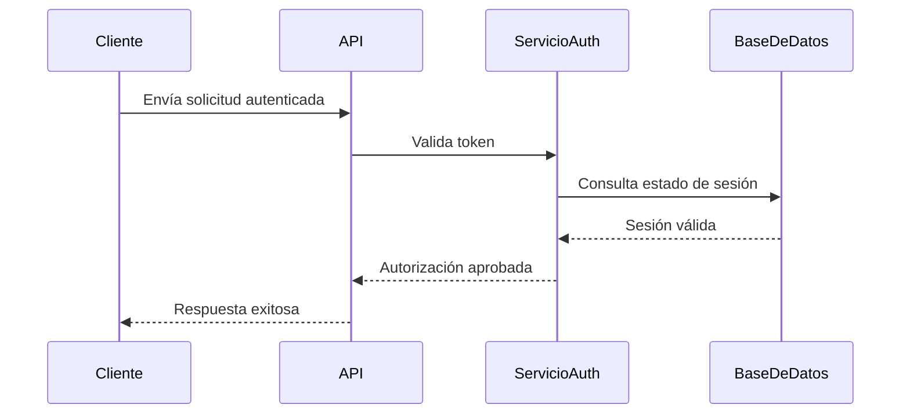

# Skill: Resumir y actualizar descripción de Pull Request en español

## Objetivo

Usa esta skill para revisar los cambios de un Pull Request y actualizar automáticamente el título y la descripción del PR con un resumen estructurado, claro y útil para revisores humanos, inspirado en el formato de CodeRabbit.

El título y la descripción finales del PR deben estar completamente en español, deben usar Markdown válido (en el caso de la descripción) y deben quedar listos para publicarse en el Pull Request.

## Cuándo usar esta skill

Usa esta skill cuando el usuario pida cualquiera de las siguientes acciones:

- Revisar un Pull Request y actualizar su título o su descripción.
- Generar un resumen estructurado del PR.
- Crear o mejorar el título o la descripción de un PR con información basada en el diff.
- Preparar un título y una descripción de PR en español para revisión humana.
- Analizar cambios de un PR y documentarlos con resumen, riesgos, checks, issues, PRs relacionados y reviewers sugeridos, y aplicar etiquetas al PR.

No uses esta skill para modificar código fuente, generar cambios funcionales, crear commits, ejecutar acciones sugeridas o alterar archivos del repositorio. Esta skill solo debe analizar el Pull Request, editar su título y su descripción, y aplicar etiquetas al PR.

## Principios obligatorios

- El título y toda la descripción final del PR deben estar en español.
- El título debe reflejar fielmente el cambio principal del PR, ser conciso y no inventar alcance.
- Mantén un tono claro, profesional y útil para revisores humanos.
- No inventes información.
- Si algún dato no se puede verificar, escribe `No detectado` o `No disponible`, según corresponda.
- No inventes issues, PRs, reviewers, labels ni resultados de checks.
- No modifiques código fuente.
- No ejecutes acciones opcionales sin confirmación explícita del usuario.
- Preserva cualquier información importante ya existente en la descripción del PR, salvo que esté obsoleta, sea duplicada o contradiga los cambios reales del PR.
- Si el PR es pequeño, mantén la descripción breve pero completa.
- Si el PR es grande, riesgoso o toca áreas críticas, incluye más detalle en el resumen, cambios, riesgos y esfuerzo estimado.
- Usa tablas cuando ayuden a mejorar la legibilidad.
- Usa Mermaid únicamente cuando el flujo lo justifique.
- La salida debe quedar lista para publicarse como descripción del PR.

## Información que debes analizar

Antes de editar la descripción del PR, recopila y analiza toda la información disponible del Pull Request actual.

### 1. Diff completo del PR

Revisa el diff completo del Pull Request, incluyendo:

- Archivos agregados, modificados, renombrados y eliminados.
- Cambios de lógica de negocio.
- Cambios en frontend, backend, base de datos, seguridad, autenticación, integraciones, APIs, servicios, procesos asíncronos, configuración, CI/CD, documentación y pruebas.
- Cambios que puedan introducir regresiones o modificar comportamiento existente.
- Cambios fuera de alcance o no relacionados con el objetivo aparente del PR.

### 2. Propósito general

Identifica:

- Qué problema intenta resolver el PR.
- Qué comportamiento agrega, elimina o modifica.
- Qué impacto tiene para usuarios, desarrolladores, sistemas internos o integraciones.
- Si el propósito no está claro, dilo explícitamente.

### 3. Cambios principales

Resume los cambios principales por archivo, ruta o grupo lógico de archivos.

Agrupa archivos cuando sea útil, por ejemplo:

- `src/services/**`
- `src/components/auth/**`
- `tests/unit/**`
- `docs/**`

Evita listar archivos irrelevantes uno por uno cuando un grupo lógico sea más claro.

### 4. Riesgos potenciales

Identifica posibles riesgos, especialmente si el PR toca:

- Autenticación o autorización.
- Seguridad.
- Base de datos o migraciones.
- APIs públicas.
- Integraciones externas.
- Procesos asíncronos, jobs, colas o eventos.
- Configuración de despliegue o infraestructura.
- Cambios de contratos entre servicios.
- Lógica compleja o de alto impacto.
- Áreas sin pruebas claras.

No exageres riesgos. Si no se detectan riesgos relevantes, indícalo de forma breve.

### 5. Checks, pruebas y CI

Cuando la información esté disponible, revisa:

- Checks de CI.
- Pruebas ejecutadas.
- Checks fallidos, pendientes, cancelados o con advertencias.
- Cobertura de pruebas cuando sea visible.
- Linters, type checks, builds y validaciones automáticas.
- Señales de que faltan pruebas manuales o automatizadas.

Si no puedes verificar los checks o pruebas, usa `No disponible`.

### 6. Issues relacionados

Busca referencias explícitas o relaciones claras con issues, por ejemplo:

- `Fixes #123`
- `Closes #123`
- `Related to #123`
- Referencias en commits, descripción del PR, comentarios, nombre de rama o diff.
- Cambios que correspondan claramente a un issue mencionado.

No inventes issues por similitud vaga. Si no hay evidencia suficiente, escribe `No detectado`.

### 7. PRs relacionados

Busca PRs relacionados cuando haya evidencia razonable, por ejemplo:

- Referencias explícitas a otros PRs.
- PRs previos mencionados.
- PRs apilados.
- Ramas similares.
- Cambios dependientes.
- Continuaciones claras de trabajos anteriores.

No inventes PRs relacionados. Si no hay evidencia suficiente, escribe `No detectado`.

### 8. Labels (etiquetas a aplicar)

Determina las etiquetas relevantes según el contenido real del PR para aplicarlas directamente al Pull Request (no como sección de la descripción).

Usa únicamente etiquetas estándar de la industria. No inventes etiquetas. El conjunto de referencia son las etiquetas por defecto que GitHub crea en todo repositorio nuevo:

| Etiqueta | Significado | Cuándo aplicarla al PR |
| -------- | ----------- | ---------------------- |
| `bug` | Algo no funciona. | El PR corrige un comportamiento incorrecto o defecto. |
| `documentation` | Mejoras o adiciones a la documentación. | El PR cambia principalmente documentación (README, docs, comentarios). |
| `duplicate` | Ya existe un issue o PR equivalente. | El PR duplica trabajo ya existente. |
| `enhancement` | Nueva funcionalidad o mejora. | El PR agrega o mejora una funcionalidad. |
| `good first issue` | Bueno para personas nuevas. | El cambio es sencillo y adecuado para contribuyentes nuevos. |
| `help wanted` | Se necesita atención o ayuda extra. | El PR requiere ayuda o revisión adicional. |
| `invalid` | Parece que algo no está bien. | El PR es incorrecto o no aplica. |
| `question` | Se requiere más información. | El PR está abierto a discusión o necesita aclaración. |
| `wontfix` | No se va a trabajar. | El cambio se decide no continuar. |

Reglas:

- Limítate a este conjunto estándar; no crees nombres de etiquetas propios.
- Las etiquetas deben basarse en el diff real, no en suposiciones.
- Aplica únicamente etiquetas que ya existan en el repositorio. Verifícalo con `gh label list`.
- En la práctica, lo más común es aplicar `bug` para correcciones, `enhancement` para nuevas funcionalidades y `documentation` para cambios de docs.
- Si una etiqueta estándar útil no existe en el repositorio, no la inventes ni la apliques; menciónala al usuario como sugerencia y ofrece crearla solo con su confirmación.
- La aplicación de etiquetas se describe en la sección "Cómo aplicar las etiquetas al PR".

### 9. Reviewers

Sugiere reviewers únicamente si puedes inferirlos de forma razonable por:

- CODEOWNERS.
- Historial de cambios.
- Autoría previa en los archivos modificados.
- Reviewers ya asignados.
- Convenciones visibles del repositorio.
- Contexto explícito del PR.

Si no hay información suficiente, escribe `No detectado`.

## Cómo generar el título del PR

El título debe resumir el cambio principal del PR en una sola línea, en español, clara y concisa.

Reglas:

- Sigue el formato de Conventional Commits cuando el repositorio lo use: `tipo(scope): descripción` (por ejemplo `feat(auth): validar tokens antes de procesar solicitudes`).
  - Tipos comunes: `feat`, `fix`, `refactor`, `docs`, `test`, `chore`, `perf`, `build`, `ci`.
  - Detecta el formato observando el título actual del PR, los mensajes de commit o el nombre de la rama. Si el repositorio no usa Conventional Commits, escribe un título descriptivo simple en español.
- El título debe basarse en el diff real y en el cambio principal del PR, no en suposiciones.
- Mantén el `tipo` y el `scope` en inglés (convención técnica) y la descripción en español.
- Sé conciso: idealmente no más de ~72 caracteres. Evita puntos finales.
- No incluyas números de issue ni PR en el título salvo que ya estuvieran y sigan siendo correctos.
- Si el PR agrupa varios cambios, prioriza el más relevante o usa un título general representativo.
- Preserva el título actual si ya es correcto, claro y representa fielmente el PR; en ese caso no lo cambies.

Si no puedes determinar un título mejor que el actual a partir del diff, conserva el título existente.

## Cómo actualizar el título y la descripción del PR

1. Lee el título y la descripción actuales del PR.
2. Detecta información importante existente que deba preservarse, como:
   - Contexto del problema.
   - Links relevantes.
   - Instrucciones de testing.
   - Screenshots o videos.
   - Notas de rollout.
   - Breaking changes.
   - Checklists manuales.
3. Elimina o reemplaza información obsoleta, duplicada o contradictoria.
4. Genera un nuevo título siguiendo las reglas de la sección "Cómo generar el título del PR".
5. Genera una nueva descripción usando exactamente la estructura definida en esta skill.
6. Integra la información importante preservada dentro de las secciones adecuadas.
7. Actualiza únicamente el título y el cuerpo o descripción del PR (por ejemplo con `gh pr edit <número> --title "..." --body "..."`).
8. Aplica las etiquetas relevantes al PR siguiendo la sección "Cómo aplicar las etiquetas al PR".
9. No modifiques código, commits, ramas, archivos fuente ni configuración del repositorio.
10. No ejecutes sugerencias de “Toques finales” sin confirmación explícita del usuario.

## Cómo aplicar las etiquetas al PR

A diferencia de issues, PRs relacionados o reviewers (que solo se sugieren en la descripción), las etiquetas sí se aplican directamente al Pull Request.

Pasos:

1. Determina las etiquetas relevantes según la sección "8. Labels (etiquetas a aplicar)".
2. Lista las etiquetas existentes en el repositorio con `gh label list` para confirmar cuáles puedes aplicar.
3. Aplica solo las etiquetas existentes que correspondan al PR con:

   ```bash
   gh pr edit <número> --add-label "bug" --add-label "documentation"
   ```

4. No elimines etiquetas existentes del PR salvo que el usuario lo pida o sean claramente incorrectas según el diff.
5. Si una etiqueta útil no existe en el repositorio, no la apliques ni la crees automáticamente. Indícaselo al usuario y crea la etiqueta solo con su confirmación (por ejemplo con `gh label create`).
6. No inventes etiquetas. Si no hay etiquetas razonables para el PR, no apliques ninguna e indícalo brevemente.

Al terminar, informa al usuario qué etiquetas se aplicaron y cuáles se sugirieron pero no se aplicaron por no existir.

## Estructura obligatoria de la descripción del PR

Usa exactamente estas secciones, en este orden.

```markdown
# Resumen

Resumen completo generado por IA sobre el propósito del PR y sus cambios clave, escrito para revisores humanos. Debe explicar qué problema resuelve el PR y qué impacto tiene.

# Recorrido general

Resumen breve y claro de lo que cambió en este Pull Request.

# Cambios

| Archivo(s) / Ruta(s) | Resumen del cambio |
| -------------------- | ------------------ |
| `src/middleware/auth.ts` | Resumen de los cambios realizados en este archivo. |
| `src/services/token-service.ts` | Resumen de los cambios realizados en este archivo. |

# Diagramas de secuencia

Incluir uno o más diagramas de secuencia en Mermaid cuando el PR modifique flujos importantes, autenticación, APIs, servicios, procesos asíncronos, integraciones o lógica entre múltiples componentes.

Si no aplica, escribir:

No aplica.

# Esfuerzo estimado de revisión

🎯 3 (Moderado) | ⏱️ ~25 minutos

# Posibles issues relacionados

* Issue relacionado #4521 - Motivo por el cual este issue parece relacionado.
* Otro issue relacionado #4498 - Motivo por el cual este issue parece relacionado.

Si no se detectan, escribir:

No detectado.

# Posibles PRs relacionados

* `feat: PR relacionado #4510` - Motivo por el cual este PR parece relacionado.
* `fix: Otro PR relacionado #4487` - Motivo por el cual este PR parece relacionado.

Si no se detectan, escribir:

No detectado.

# Reviewers sugeridos

* harjotgill
* guritfaq

Si no hay información suficiente, escribir:

No detectado.

# Checks pre-merge

## 🚥 Checks pre-merge | ✅ 3 | ❌ 2

### ❌ Checks fallidos o con advertencias

| Check | Estado | Explicación | Resolución sugerida |
| ----- | ------ | ----------- | ------------------- |
| Revisión de descripción | ⚠️ Advertencia | Motivo por el cual el check falló o requiere atención. | Cómo se puede corregir. |
| Cobertura de docstrings | ⚠️ Advertencia | Motivo por el cual requiere atención. | Cómo se puede corregir. |

### ✅ Checks aprobados

| Check | Estado | Explicación |
| ----- | ------ | ----------- |
| Revisión de título | ✅ Aprobado | Motivo por el cual el título es correcto. |
| Issues vinculados | ✅ Aprobado | Motivo por el cual el PR cumple con este punto. |
| Cambios fuera de alcance | ✅ Aprobado | Motivo por el cual no se detectaron cambios fuera de alcance. |

# ✨ Toques finales sugeridos

Incluir acciones opcionales que podrían mejorar el PR antes de mergear:

* 📝 Generar docstrings
* Crear PR apilado
* Hacer commit en la rama actual
* 🪡 Generar unit tests
* Crear PR con unit tests
* Hacer commit de unit tests en la rama
```

## Instrucciones por sección

### `# Resumen`

Escribe un resumen completo generado por IA sobre el propósito del PR y sus cambios clave.

Debe explicar:

- Qué problema resuelve el PR.
- Qué cambia a nivel funcional o técnico.
- Qué impacto tiene.
- Qué partes del sistema se ven afectadas.
- Qué debe tener en cuenta un revisor humano.

No debe ser genérico. Debe basarse en el diff y en la información verificable del PR.

Si el propósito no se puede determinar, escribe algo como:

```markdown
El propósito exacto del PR no está completamente disponible a partir de la información revisada. Según el diff, el cambio parece centrarse en...
```

### `# Recorrido general`

Incluye un resumen breve y claro de lo que cambió.

Debe ser más corto que `# Resumen` y funcionar como una vista rápida para revisores.

Ejemplo:

```markdown
Este PR actualiza el flujo de autenticación para validar tokens antes de procesar solicitudes protegidas, ajusta el servicio responsable de renovar credenciales y agrega pruebas unitarias para los nuevos escenarios de expiración.
```

### `# Cambios`

Incluye una tabla con rutas o grupos de rutas y un resumen del cambio.

Formato obligatorio:

```markdown
| Archivo(s) / Ruta(s) | Resumen del cambio |
| -------------------- | ------------------ |
| `ruta/del/archivo.ts` | Resumen concreto del cambio. |
```

Reglas:

- Agrupa archivos relacionados cuando mejore la lectura.
- Usa rutas exactas cuando sea útil.
- No incluyas archivos que no puedas verificar.
- No rellenes la tabla con ejemplos ficticios.
- Si no puedes leer el diff, escribe `No disponible`.

### `# Diagramas de secuencia`

Incluye uno o más diagramas de secuencia en Mermaid cuando el PR modifique flujos importantes, como:

- Autenticación.
- Autorización.
- APIs.
- Servicios.
- Procesos asíncronos.
- Integraciones externas.
- Comunicación entre múltiples componentes.
- Flujos de datos relevantes.
- Jobs, colas o eventos.

Ejemplo de formato cuando aplica:

```markdown

```

Si no aplica, escribe exactamente:

```markdown
No aplica.
```

No fuerces diagramas si el PR solo contiene cambios simples, documentación, estilos, tests aislados o refactors locales sin flujo entre componentes.

### `# Esfuerzo estimado de revisión`

Usa este formato exacto:

```markdown
🎯 3 (Moderado) | ⏱️ ~25 minutos
```

La estimación debe considerar:

- Cantidad de archivos modificados.
- Complejidad de la lógica.
- Riesgo del cambio.
- Necesidad de pruebas manuales.
- Impacto en frontend, backend, base de datos, seguridad o integraciones.

Escala sugerida:

| Nivel | Etiqueta | Guía |
| ----- | -------- | ---- |
| 1 | Muy bajo | Cambio trivial, pocos archivos, bajo riesgo, revisión rápida. |
| 2 | Bajo | Cambio pequeño, lógica simple, riesgo limitado. |
| 3 | Moderado | Varios archivos o lógica relevante, requiere revisión cuidadosa. |
| 4 | Alto | Cambio amplio, áreas críticas, pruebas manuales o impacto significativo. |
| 5 | Muy alto | Cambio grande, riesgoso, arquitectura, seguridad, base de datos o múltiples sistemas. |

Ajusta los minutos estimados de forma razonable. No uses siempre 25 minutos.

### `# Posibles issues relacionados`

Lista issues relacionados solo si hay evidencia verificable.

Formato:

```markdown
* Issue relacionado #4521 - Motivo por el cual este issue parece relacionado.
* Otro issue relacionado #4498 - Motivo por el cual este issue parece relacionado.
```

Si no se detectan, escribe exactamente:

```markdown
No detectado.
```

### `# Posibles PRs relacionados`

Lista PRs relacionados solo si hay evidencia verificable.

Formato:

```markdown
* `feat: PR relacionado #4510` - Motivo por el cual este PR parece relacionado.
* `fix: Otro PR relacionado #4487` - Motivo por el cual este PR parece relacionado.
```

Si no se detectan, escribe exactamente:

```markdown
No detectado.
```

### `# Reviewers sugeridos`

Sugiere reviewers únicamente si hay base razonable.

Ejemplo:

```markdown
* harjotgill
* guritfaq
```

Si no hay información suficiente, escribe exactamente:

```markdown
No detectado.
```

No inventes reviewers a partir de suposiciones vagas.

### `# Checks pre-merge`

Usa esta estructura:

```markdown
## 🚥 Checks pre-merge | ✅ 3 | ❌ 2

### ❌ Checks fallidos o con advertencias

| Check | Estado | Explicación | Resolución sugerida |
| ----- | ------ | ----------- | ------------------- |
| Revisión de descripción | ⚠️ Advertencia | Motivo por el cual el check falló o requiere atención. | Cómo se puede corregir. |

### ✅ Checks aprobados

| Check | Estado | Explicación |
| ----- | ------ | ----------- |
| Revisión de título | ✅ Aprobado | Motivo por el cual el título es correcto. |
```

Reglas:

- Cuenta como aprobados solo los checks que puedas verificar como correctos o satisfactorios.
- Cuenta como fallidos o advertencias los checks que estén fallidos, incompletos, pendientes o requieran atención.
- Si no hay información de CI disponible, indícalo como advertencia o `No disponible` dentro de la tabla.
- No inventes resultados de CI.
- Puedes incluir checks cualitativos derivados del análisis, por ejemplo:
  - Revisión de descripción.
  - Revisión de título.
  - Issues vinculados.
  - Cobertura de pruebas.
  - Cambios fuera de alcance.
  - Riesgo de seguridad.
  - Compatibilidad con migraciones.
  - Evidencia de pruebas manuales.
  - Estado de CI.
- Si no hay checks verificables, usa una estructura honesta, por ejemplo:

```markdown
## 🚥 Checks pre-merge | ✅ 0 | ❌ 1

### ❌ Checks fallidos o con advertencias

| Check | Estado | Explicación | Resolución sugerida |
| ----- | ------ | ----------- | ------------------- |
| Estado de CI | ⚠️ No disponible | No se pudo verificar información de checks o CI para este PR. | Revisar los checks del PR antes de mergear. |

### ✅ Checks aprobados

No disponible.
```

### `# ✨ Toques finales sugeridos`

Incluye acciones opcionales que podrían mejorar el PR antes de mergear.

Ejemplos:

```markdown
* 📝 Generar docstrings
* Crear PR apilado
* Hacer commit en la rama actual
* 🪡 Generar unit tests
* Crear PR con unit tests
* Hacer commit de unit tests en la rama
```

Reglas:

- Estas acciones son sugerencias.
- No ejecutes ninguna de estas acciones automáticamente.
- No hagas commits automáticamente.
- No crees PRs automáticamente.
- No generes ni modifiques archivos automáticamente como parte de esta sección.
- Si una acción no aplica, no la incluyas.
- Prioriza acciones útiles según el análisis real del PR.

## Manejo de información incompleta

Cuando falten datos:

- Usa `No detectado` para información que buscaste pero no encontraste, como issues, PRs relacionados o reviewers.
- Usa `No disponible` para información que no pudiste consultar o verificar, como CI, checks, pruebas o metadata inaccesible.
- Explica brevemente cuando una sección dependa de información no disponible.
- No rellenes espacios con suposiciones.

Ejemplos:

```markdown
# Posibles issues relacionados

No detectado.
```

```markdown
# Reviewers sugeridos

No detectado.
```

```markdown
| Check | Estado | Explicación | Resolución sugerida |
| ----- | ------ | ----------- | ------------------- |
| Estado de CI | ⚠️ No disponible | No se pudo verificar el estado de CI con la información disponible. | Revisar los checks en la interfaz del PR antes de mergear. |
```

## Reglas para preservar información existente

Antes de reemplazar la descripción del PR:

- Revisa si la descripción actual contiene detalles útiles.
- Conserva links importantes.
- Conserva instrucciones de prueba manual si siguen vigentes.
- Conserva screenshots, videos o notas de QA si siguen siendo relevantes.
- Conserva advertencias de rollout, migraciones o breaking changes.
- Elimina contenido duplicado si la nueva estructura ya lo cubre.
- Elimina contenido obsoleto si contradice el diff o el estado actual del PR.

Cuando conserves información existente, intégrala en la sección más adecuada. Si no encaja en ninguna sección, puedes añadirla dentro de `# Resumen` o `# Checks pre-merge`, siempre manteniendo la estructura principal.

## Reglas para Mermaid

Incluye Mermaid solo cuando ayude a entender un flujo real modificado por el PR.

Usa `sequenceDiagram` para flujos entre componentes.

No uses Mermaid para:

- Cambios puramente documentales.
- Ajustes de estilos.
- Renombres simples.
- Tests aislados.
- Refactors internos sin cambio de interacción entre componentes.
- Cambios de configuración simples.

Si usas Mermaid:

- El diagrama debe estar en español.
- Los participantes deben representar componentes reales o inferidos claramente del diff.
- No incluyas pasos que no estén respaldados por el cambio.
- Mantén el diagrama breve y legible.

## Checklist interno antes de actualizar el PR

Antes de guardar la descripción final, verifica:

- [ ] El título y la descripción completa están en español.
- [ ] El título resume fielmente el cambio principal y sigue la convención del repositorio.
- [ ] El resumen explica propósito, impacto y cambios clave.
- [ ] El recorrido general es breve y claro.
- [ ] La tabla de cambios usa rutas reales o grupos verificables.
- [ ] Los diagramas Mermaid solo aparecen si aplican.
- [ ] El esfuerzo estimado sigue el formato requerido.
- [ ] Issues relacionados no fueron inventados.
- [ ] PRs relacionados no fueron inventados.
- [ ] Las etiquetas aplicadas al PR son razonables, existen en el repositorio y se basan en el diff.
- [ ] Reviewers sugeridos tienen base verificable o razonable.
- [ ] Checks pre-merge no inventan resultados.
- [ ] Los toques finales son sugerencias y no se ejecutaron automáticamente.
- [ ] Se preservó información importante existente cuando correspondía.
- [ ] No se modificó código fuente.
- [ ] La salida está lista para publicarse como descripción del PR.

## Resultado esperado

Al finalizar, el título y la descripción del Pull Request deben:

- Estar en español.
- Tener un título conciso que refleje fielmente el cambio principal y siga la convención del repositorio.
- Ser claros y útiles para revisores humanos.
- Reflejar fielmente el diff y la información disponible.
- Indicar explícitamente datos no detectados o no disponibles.
- Usar la estructura obligatoria definida en esta skill (en la descripción).
- Estar listos para publicarse en el título y el cuerpo del PR.
